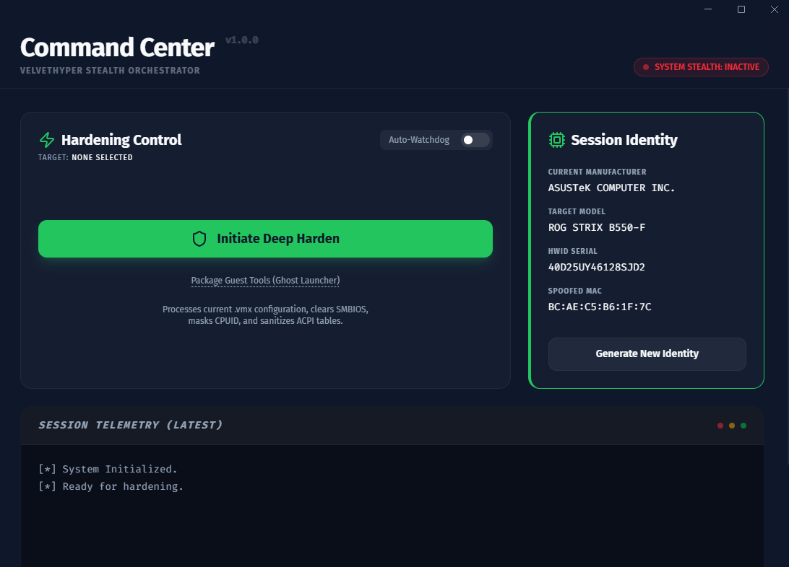

<p align="center">
  
</p>

<h1 align="center">🔮 VelvetHyper</h1>
<p align="center"><strong>Pro-Grade Stealth Virtualization Suite</strong></p>

<p align="center">
  
  
  
  
  
  
</p>

---

> [!WARNING]
> **Disclaimer — Read Before Use**
>
> VelvetHyper is intended strictly for **educational and research purposes**: studying hypervisor detection techniques, VM forensics, and counter-detection research in controlled environments.
>
> - You are solely responsible for compliance with your jurisdiction's laws and the Terms of Service of any software you interact with.
> - Using this tool to bypass anti-cheat systems in online games may result in permanent bans.
> - The authors accept **no liability** for misuse, damages, or account penalties of any kind.
> - Do **not** use this in production environments or against systems you do not own.

---

## What It Does

VelvetHyper transforms a standard VMware virtual machine into an environment indistinguishable from physical hardware by systematically spoofing every layer that kernel-level software inspects:

| Layer | What Gets Spoofed |
|-------|-------------------|
| **SMBIOS** | Board ID, serial number, hardware UUID, manufacturer |
| **BIOS** | Vendor string, version, release date |
| **CPUID** | Hypervisor present bit (ECX leaf 1), leaf `0x40000000` |
| **Network** | MAC address via real OUI database entries |
| **Anti-VM** | Backdoor port, VT32, RDTSC virtualization, extended HV |
| **Isolation** | All VMware guest↔host communication channels |
| **Time Sync** | All VMware clock synchronization mechanisms |
| **Total** | **40 flags per hardening run** |

---

## 🏗️ Architecture

```
velvethyper/
├── apps/
│   ├── desktop_ui/          # Electron + React "Command Center" dashboard
│   └── cli_engine/
│       ├── harden.py        # CLI hardening entry point (also invoked by UI)
│       └── main.py          # Interactive profile-based CLI
├── libs/
│   ├── spoofer_core/        # Python hardening engine
│   │   ├── vmx_hardener.py  # Core VMX manipulation class
│   │   ├── cpu_masker.py    # CPUID flag generator
│   │   ├── profile_manager.py
│   │   └── assets/
│   │       └── hardware_profiles.json  # 20 real-world hardware profiles
│   └── native_utils/        # C++ guest-side tools
│       ├── launcher.cpp      # Ghost Launcher (self-deleting)
│       ├── sanitizer.cpp     # Hypervisor registry scrubber
│       └── verifier.cpp      # Integrity verifier
├── profiles/                # Saved hardware identities (JSON)
├── docs/                    # Project documentation
├── scripts/
│   └── clean.py             # Cross-platform build cleaner
└── Makefile                 # Master orchestration
```

---

## 🚀 Quick Start

### Prerequisites

| Dependency | Version | Required For |
|------------|---------|-------------|
| [Node.js](https://nodejs.org/) | 18+ | Desktop UI |
| [Python](https://python.org/) | 3.8+ | Hardening engine |
| [Git Bash / Make](https://gitforwindows.org/) | any | `make` commands (Windows) |
| [MinGW-w64](https://www.mingw-w64.org/) | any | Native utils (optional) |

### Install & Run

```bash
# Clone
git clone https://github.com/excflor/velvethyper.git
cd velvethyper

# Install all dependencies
make install

# Launch the Command Center
make dev
```

### First Use

1. **Select VMX** — Click the target filename in the Hardening Control card to browse for your `.vmx` file
2. **Generate Identity** — Click **Generate New Identity** to randomize a hardware profile
3. **Harden** — Click **Initiate Deep Harden** — the exact identity shown in Session Identity is written to your VMX
4. **Guest Tools** *(optional)* — Click **Package Guest Tools** to compile the C++ sanitizer for the guest VM

---

## 📦 Makefile Reference

```bash
make install          # Install Python deps + UI npm packages
make dev              # Launch Command Center (hot-reload dev mode)
make run              # Alias for 'make dev'

make build-ui         # Package portable Windows .exe
make build-native     # Compile C++ guest payloads (requires MinGW)

make harden VMX="D:/path/to/vm.vmx"   # Harden from CLI (random profile)

make lint             # ESLint (TypeScript) + ruff (Python)
make typecheck        # TypeScript type-check, no emit
make format           # Prettier + ruff format
make clean            # Remove all build artifacts and caches
make release          # Bump version, tag, push to GitHub
```

---

## 🐍 CLI Reference

```bash
# Apply a random stealth profile from the built-in database
python apps/cli_engine/harden.py path/to/vm.vmx

# Check hardening status without modifying anything
python apps/cli_engine/harden.py --check path/to/vm.vmx

# Interactive CLI — load or create a named profile
python apps/cli_engine/main.py --profile my_rig
```

---

## 📦 Production Build

```bash
make build-ui
# → apps/desktop_ui/dist/VelvetHyper-Portable-1.0.0.exe
```

The portable `.exe` is fully self-contained — all Python scripts are bundled inside `resources/`. No separate Python installation is needed on the host machine.

### Guest Sanitization Workflow *(optional)*

1. Run `VelvetHyper.exe` on the **host** — select VMX, generate identity, harden
2. Click **Package Guest Tools** to compile the C++ sanitizer
3. Copy `build/launcher.exe` into the **guest VM**
4. Run `launcher.exe` as **Administrator** inside the guest
   - Scrubs hypervisor-aware registry keys
   - Verifies integrity of critical system values
   - **Self-deletes** all traces from the guest disk
5. **Reboot** the guest VM

---

## 🛠️ Troubleshooting

**`make: command not found` on Windows**
> Install [Git for Windows](https://gitforwindows.org/) — it includes GNU Make. Run commands from Git Bash or add `C:\Program Files\Git\usr\bin` to your PATH.

**`python: command not found`**
> Ensure Python 3.8+ is installed and added to `PATH` during setup. On some systems use `python3` instead — the Makefile auto-detects this on Linux/macOS.

**`CRITICAL: No such file or directory` when hardening**
> The `.vmx` file cannot be open in VMware while hardening. Shut down the VM completely (not just suspend) before selecting it.

**`Profile Rotation Failed: ENOENT`**
> Rebuild the portable exe after any changes (`make build-ui`). The profile database must be bundled in `resources/libs/spoofer_core/assets/`.

**`0 flags applied` in logs**
> This was a bug fixed in v1.0.0. Ensure you are on the latest commit.

---

## 🤝 Contributing

Contributions are welcome. Areas where help is most valuable:

- **Hardware Profiles** — Add more real-world entries to [`libs/spoofer_core/assets/hardware_profiles.json`](libs/spoofer_core/assets/hardware_profiles.json). Each profile needs: `manufacturer`, `model`, `bios_version`, `bios_date`, `mac_oui`, `type`, `serial_prefix`.
- **Detection Research** — New anti-cheat detection vectors and corresponding VMX flags.
- **Native Utils** — Improvements to the C++ guest-side tools.
- **Tests** — Unit tests for `VMXHardener` and `CPUMasker`.

```bash
# Before submitting a PR
make lint
make typecheck
```

Please keep PRs focused. One feature or fix per PR.

---

## 📄 License

MIT License — see [LICENSE](LICENSE) for full text.

---

<p align="center"><em>VelvetHyper — Advanced Hypervisor Stealth & Orchestration Suite</em></p>
